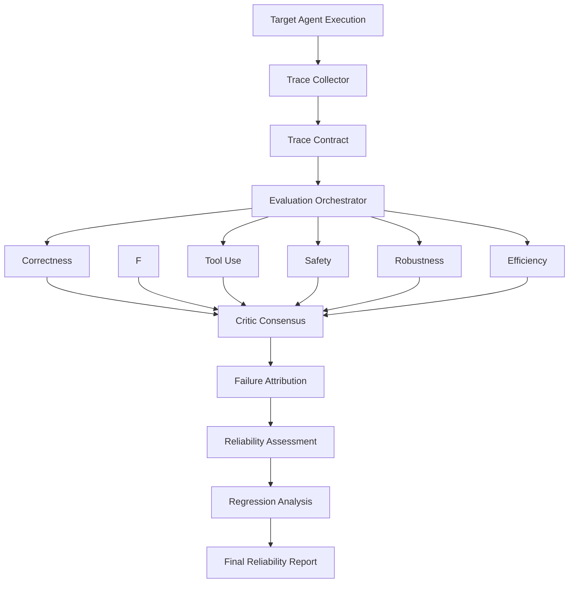

# Architecture

Aegis evaluates structured execution traces produced by an external target
agent or application. It does not launch arbitrary target agents.

The FastAPI boundary normalizes input, persists traces in PostgreSQL, invokes
the evaluation service, persists the report, and streams trace/report events
to the dashboard over WebSockets. Evaluation modules remain independent of
FastAPI and frontend code.
